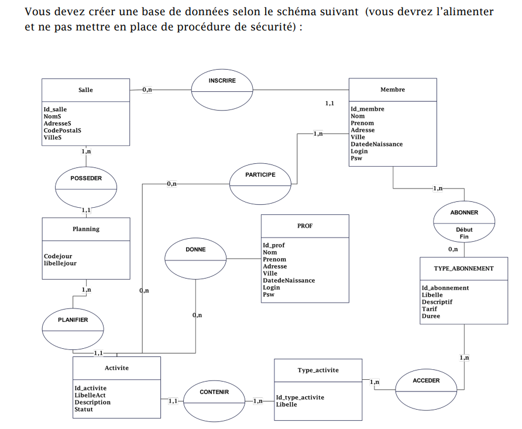

# Projet-InjectionSql-GroupeA

# Sommaire
- [Projet-InjectionSql-GroupeA](#projet-injectionsql-groupea)
- [Sommaire](#sommaire)
- [Projet](#projet)
  - [Description](#description)
  - [Objectifs](#objectifs)
  - [Outils](#outils)
  - [Équipe](#équipe)
  - [Plan du projet](#plan-du-projet)
  - [Ressources utiles](#ressources-utiles)
  - [Contact](#contact)
- [Divers](#divers)
  - [Liens](#liens)
  - [Idetifient](#idetifient)

# Projet
## Description
Ce projet vise à tester les injections SQL sur un site de sport que nous créons. 

## Objectifs
- [x] Créer le projet sur Github

- [x] Créer le site de sport
    - [x] Définir la structure du site
      - [x] Une page d’accueil
      - [x] Une page de présentation des activités
      - [x] Une page connexion membre 
    - [x] Développer les fonctionnalités du site
      - [x] Acces a la base de donnés *phpMyAdmin*
      - [x] Configuration de la BD   
    - [x] Tester le site

- [ ] Élaborer les requêtes SQL
    - [ ] Définir les requêtes nécessaires
    - [ ] Implémenter les requêtes dans le site
    - [ ] Tester les requêtes

- [ ] Effectuer des tests d'injection SQL
    - [ ] Définir les scénarios de test
    - [ ] Exécuter les tests d'injection SQL
    - [ ] Analyser les résultats des tests
     
  
---

- [ ] Documenter tout le processus et partager les résultats

Optionel -Apres le projet si envie- :
- [ ] Implémenter des mesures de sécurité contre les injections SQL
    - [ ] Rechercher et comprendre les meilleures pratiques de sécurité
    - [ ] Appliquer ces pratiques au site
    - [ ] Tester à nouveau le site

---

## Outils
- Langages : HTML, CSS, JavaScript, SQL
- Base de donenées : phpMyAdmin

## Équipe
- FREYERMUTH Matys
- CRUGNOLA Loris

## Plan du projet
1. Conception du site de sport
2. Test d'injections SQL
3. Analyse des résultats
4. Implémentation des mesures de sécurité
5. Test final et déploiement

## Ressources utiles
- PowerPoint -Moodle-

## Contact
Pour toute question ou suggestion, n'hésitez pas à nous contacter à l'adresse email suivante : XXXX@gmail.com

# Divers
## Liens
- [PowerPoint -Moodle-](https://0670086e.moodle.monbureaunumerique.fr/pluginfile.php/78774/mod_resource/content/1/Pr%C3%A9sentation%20FRC-BTS%20SIO%20lutter%20contre%20les%20APT.pdf)

## Idetifient
> Sylvia Victime  
> XXGROUP
